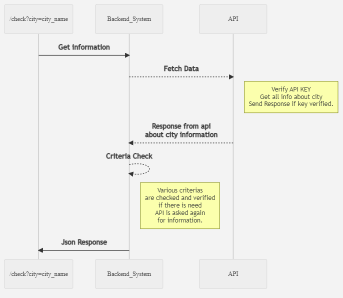

# Api Task
This would be a small api designed to perform some operations on weather data of a city. 

## Project Architecture
 

At the beginning, a request is sent to an endpoint with a city name. The city name is later validated and all the regarding weather information about that specific city is fetched. Once the information is fetched, it is later evaluated against certain predefined criteria. These criteras are executed in random order.


## Source Code Structure
```
Api- Criteria Check
	
	|-- images                      	# images of architecture
	
	|-- API-Task     	             
		|-- application            
			|-- CriteriaCheckApi        # Main application logic folder 		
				|-- api
				    | -- CriteriaInfo   # Classes and helpful functions needed to assist the criteria checks
				|-- routes.py			# Containes Application logic with routesr
		|-- config.py                   # Flask Application config file
		|-- requirements.txt            # Packages needed for the application
		|-- run.py                      # Main file which serves as a starting point for the service
```
## Setup and Configuration
To launch the application perform the following:

### Step 1.
Create a virtual environment:
```
python -m venv <name of virtual environment>
```
Activate the virtual environment
Windows:
```
<name of virtual environment>/Scripts/activate
```
Linux:
```
<name of virtual environment>/bin/activate
```
### Step 2.
Install all requirements
```
pip install -r requirements.txt
```
### Step 3.
Run the application
```
python run.py
```
### Step 4.
Application starts running on local port 5000.
Go to a web-browser and type
```
http://localhost:5000
```

### Step 4.
Test the application with helpful city name, and view the results
```
http://localhost:5000/check?city=karlsruhe
```

## Running Tests
#### Step 1.
Please go to the folder tests and create a virtual environment.
```
cd test
```
#### Step 2.
You can run all of your tests using the command below
```
pytest .
```
This will run all of the basic tests defined. 
